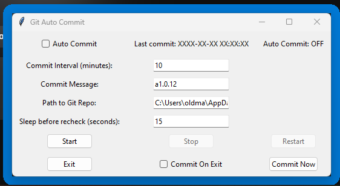

This README is oficially made [here](https://docs.oldmartijntje.nl/10-19-Spare-time/10-Projects/10.05-Python-toolkit-repo) and will be kept up to date there. It might also link to articles there that here don't link correctly.


## Programs

### DeleteFilesWhenImDead

I won't go into it fully, since the readme in [the folder](https://github.com/oldmartijntje/Python-toolkit/tree/main/DeleteFilesWhenImDead) already does that.

This application deletes your files (the ones you specified) when the program thinks you are dead. (aka pc inactive for x days). It is highly customisable, and it can mask it's deletions after it deleted to revert back to default.

Does not have GUI.

### Commiter

This is a script to auto commit every X time.



As you can see it is customisable in the GUI.

### image finder

Basically you input websites in the message.txt, and then the program scrapes the web to find images on that website, and formats it to a json format that I need for my [random website display](https://oldmartijntje.nl/ItemDisplay).

```cmd
pip install pytube
pip install requests
pip install bs4 
```


### json to md

It again has it's own small readme in [it's folder](https://github.com/oldmartijntje/Python-toolkit/tree/main/jsonToMd). But what it does is convert a json format to md.

To be more precise:

- It converts the output of [[13.02 all youtubers videos script]].
- Into [[14.00 gameTheoryMatpatDump]]

I only made this for this use.

### testdata generator

testdata generator again has it's own readme in [it's own folder](https://github.com/oldmartijntje/Python-toolkit/tree/main/testdata%20generator).

What it does is generate mock data. kinda like [[30.03 install-these#^0fd7a7|faker]], but then to be applied to json structures etc.

### youtube downloader

```cmd
pip install yt-dlp
```

You run the script to download your youtube urls, either as mp4 or mp3.

You can either:
- Paste your url's into message.txt 
- Copy paste the links into the console script when it is running.

This is because it has multiple modes.

Receipt.txt shows the links it downloaded.